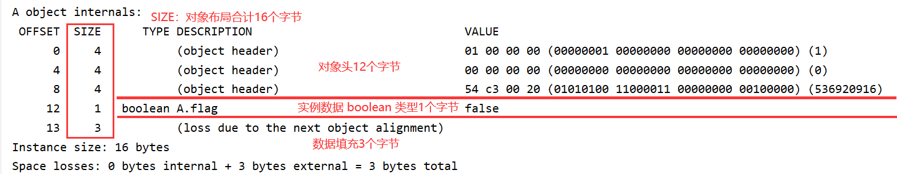

## 一、Java中的锁

### 1. Java当中有哪些锁？

公平锁、非公平锁、读写锁、共享锁、互斥锁、自旋锁、偏向锁、轻量级锁、重量级锁


### 2. ReentrantLock锁与 Sync锁的区别

```java
public class test{
   //定义一个静态对象
   static A a = new A();
  
   //定义juc下的 ReentrantLock锁对象
   static ReentrantLock reentrantlock = new ReentrantLock();
  
   public static void lockTest(){
     //使用 ReentrantLock
     reentrantLock.lock();
       //xxxxxxx操作。
     reentrantlock.unlock();
     
     //使用 Synchorized
     synchorized(a){
       //xxxxxxx操作。
     }
   }
}
```

ReentrantLock 加锁的实现原理是通过改变内部的一个变量值为1，然后通过 CAS原理来控制线程访问对象的；

那么 Sync 底层是通过改变什么变量来实现控制线程访问的呢？


### 3. Sync 通过改变什么来实现对象上锁的？

> Sync 上锁就是改变对象的对象头

**问：Java 对象是分配在堆上的，那么对象在堆上究竟会分配多大的内存呢？受到什么影响？**

**答： Java对象在内存中的布局主要包括以下三个部分：**

* Java对象的实例数据，简单来说就是对象的内部自定义成员变量，每个对象是不同的-----不固定；
* Java对象头----固定（64位虚拟机下为12个字节）；
* 数据对齐。      因为JVM是64位的虚拟机，它内部所存储的对象必须是8字节的整数倍，如果一个类的对象内部只有一个 boolean 类型的成员变量(1 byte)，那么JVM还需要为它分配7个字节的填充数据。


**问：什么是对象头？**

```java
//定义一个类，生成一个对象a
public class A {
    boolean flag;

    public static void main(String[] args) {
        A a = new A();
      
        //调用 jol包下的方法进行对象布局分析
        String s = ClassLayout.parseInstance(a).toPrintable();
        System.out.println(s);
    }
}
```

然后导入 jol依赖包进行分析：

```xml
<dependency>
    <groupId>org.openjdk.jol</groupId>
    <artifactId>jol-core</artifactId>
    <version>0.14</version>
</dependency>
```



如果将A类的 1字节flag 成员变量改为 4字节的 int 成员变量，结果如下：


**问：对象头的组成是什么？**

先弄清楚一些基本概念：

            * JVM：是一种规范和标准，不是具体的产品；
            * hotspot、j9、taobaovm 等等都是基于 JVM规范开发出来的虚拟机产品；
            * openjdk：基于C++ 编写的项目，hotspot是通过 openjdk生产的另外添加了一些商业部分，可以立即为openjdk是 hotspot的源码。


> 每个gc 管理的堆对象头的公共结构，包括堆对象的布局、类型、GC状态、同步状态和标识哈希码的基本信息。

我们知道 对象存储在 eden区，当eden区满了之后会触发 minor gc，eden和 from 存活的对象使用 copy 复制到 to中，存活的对象年龄加1然后和 from进行交换，当对象年龄达到15(在from 和 to之间来回交换15次)，就会将对象复制到老年代中，老年代如果内存不够才会触发 full gc。

**这里为什么是 15次？** 因为GC状态会保存在对象头，对象的年龄记录在对象头中的4位中(4 bit)，最大能够表示(0~15)。


Java对象头组成为： `Mark Word`    +   `Class Metadata Address`(或者说`Klass pointer`)

64位系统下面， `Mark Word`占64bit（8字节）；`Class Metadata Address` 占 32bit/64bit（4字节，这里是经过指针压缩的，未压缩时可以为 64bit）；


对象头的值会随着对象状态的不同而变化，对象状态包括以下：

* 无状态（对象刚刚 new 出来的时候）；
* 偏向锁；
* 轻量锁；
* 重量锁；
* gc 标记；


`biased_lock`：是否是偏向锁，为0表示不是，1表示是。

`lock`：表示锁的状态，用2位表示，总共可表示4种状态。


# ReentrantLock

## 一、ReentrantLock 内部组成

```java
public class ReentrantLock implements Lock, java.io.Serializable {
    /** Synchronizer providing all implementation mechanics */
    private final Sync sync;   //一个Sync类的对象,Sync继承自AbstractQueueSynchronizer抽象类
  
    //静态内部抽象类 Sync
    abstract static class Sync extends AbstractQueuedSynchronizer {
        private static final long serialVersionUID = -5179523762034025860L;

        /**
         * Performs {@link Lock#lock}. The main reason for subclassing
         * is to allow fast path for nonfair version.
         */
        abstract void lock(); //ReentrantLock.lock()方法实际上是Sync子类的方法(分公平锁和非公平锁)
    }
    
    //继承于 Sync的非公平锁
    static final class NonfairSync extends Sync {
        private static final long serialVersionUID = 7316153563782823691L;

        /**
         * 非公平锁的lock()方法，直接进行CAS操作
         */
        final void lock() {
            if (compareAndSetState(0, 1))
                setExclusiveOwnerThread(Thread.currentThread());
            else
                acquire(1);
        }
    }
  
    //继承于 Sync的公平锁
    static final class FairSync extends Sync {
        private static final long serialVersionUID = -3000897897090466540L;

        /**
         * 公平锁的 lock()方法，首先进行acquire()判断
         */
        final void lock() {
            acquire(1);
        }
      
        //注意！这个方法是AQS抽象类的
        public final void acquire(int arg) {
            if (!tryAcquire(arg) &&
                acquireQueued(addWaiter(Node.EXCLUSIVE), arg))
                selfInterrupt();
        }

        /**
         * Fair version of tryAcquire.  Don't grant access unless
         * recursive call or no waiters or is first.
         */
        protected final boolean tryAcquire(int acquires) {
            final Thread current = Thread.currentThread();  //获取当前线程
            int c = getState();   //得到volatile修饰的state变量的值，默认是0
            if (c == 0) {         //如果是0，说明当前锁没有被占用
                if (!hasQueuedPredecessors() &&
                    compareAndSetState(0, acquires)) {
                    setExclusiveOwnerThread(current);
                    return true;
                }
            }
            else if (current == getExclusiveOwnerThread()) {
                int nextc = c + acquires;
                if (nextc < 0)
                    throw new Error("Maximum lock count exceeded");
                setState(nextc);
                return true;
            }
            return false;
        }
        
        //注意！这个方法也是AQS类的，用来检查当前线程是否是队列中的第一个线程
        public final boolean hasQueuedPredecessors() {
            // The correctness of this depends on head being initialized
            // before tail and on head.next being accurate if the current
            // thread is first in queue.
            Node t = tail; // Read fields in reverse initialization order
            Node h = head;
            Node s;
            return h != t &&
                ((s = h.next) == null || s.thread != Thread.currentThread());
        }
    }
}
```

```java
//AQS抽象类
public abstract class AbstractQueuedSynchronizer
    extends AbstractOwnableSynchronizer
    implements java.io.Serializable {
    
    /**
     * Head of the wait queue, lazily initialized.  Except for
     * initialization, it is modified only via method setHead.  Note:
     * If head exists, its waitStatus is guaranteed not to be
     * CANCELLED.
     */
    private transient volatile Node head;   //队列首部

    /**
     * Tail of the wait queue, lazily initialized.  Modified only via
     * method enq to add new wait node.
     */
    private transient volatile Node tail;   //队列尾部
  
    /**
     * The current owner of exclusive mode synchronization.
     */
    private transient Thread exclusiveOwnerThread;  //持有当前锁的线程

    /**
     * The synchronization state.
     */
    private volatile int state;             //锁状态，加锁成功+1，解锁变为0
  
    //队列中的结点
    static final class Node {
        volatile Node prev;     //前一个Node
        volatile Node next;     //后一个Node
        volatile Thread thread; //Thread线程对象
    }

}
```


## 二、ReentrantLock 内部实现锁、加锁的原理

**自旋**

```java
volatile int status = 1;     //作为一个标识，来标识是否有线程在同步块，是否有线程上锁成功

//上锁方法
void lock(){
  while(!compareAndSet(0,1)){  
  }
}

//解锁方法
void unlock(){
  status = 0;
}

//CAS操作
boolean compareAndSet(int except,int newValue){
  //cas操作，修改status成功则返回true
}
```

缺点：耗费CPU资源，没有竞争到锁的线程会一直占用cpu资源进行cas操作，假如一个线程获得锁后要花费Ns处理业务逻辑，那么另外一个线程就会白白耗费Ns的cpu资源。

思路：让得不到锁的线程让出cpu资源。


**yield+自旋**

```java
volatile int status = 0;

void lock(){
  while(!compareAndSet(0,1)){
     yield();  //通过yield() 来让出cpu资源
  }
}

void unlock(){
  status = 0;
}
```

关键点：要解决自旋锁的问题必须让竞争锁失败的线程让出 cpu 资源，yield( ) 方法能够让出 cpu 资源。

缺点：但是自旋+yield 并没有完全解决问题，当系统只有两个线程竞争锁时是有效的；但是注意 yield( )  方法只是让出当前cpu，有可能操作系统下次还是选择该线程，那线程数量过大时 yield( ) 的效果就很差了。


**park+自旋  ------  AQS模拟实现**

> AQS主要借助的技术： park() + unpark() + state + 队列 + CAS

```java
Queue parkQueue;   //用一个队列来存储线程集合
volatile int status = 0;

void lock(){
  while(!compareAndSet(0,1)){
    park();        //对没有竞争到锁的线程释放cpu资源
  }
  ....             //得到锁的线程进行操作
  unlock();        //操作完后释放锁
}

void unlock(){
  //解锁时将ReentrantLock内部变量status由1变回0
  status = 0;
  lock_notify();
}

void park(){
  //将当前线程加入到等待队列
  parkQueue.add(currentThread);
  //释放当前线程的cpu，阻塞
  releaseCpu();
}

void unpark(Thread t){
  LockSupport.unpark(t);  //unpark() 底层也是unsafe类的方法
}

void releaseCpu(){
  LockSupport.park();    //park()  方法底层使用unsafe类对操作系统进行操纵
}

void lock_notify(){
  //得到要唤醒的线程头部线程
  Thread t = parkQueue.header();
  //唤醒等待线程
  unpark(t);
}
```


AQS（AbstractQueuedSynchorizer） 类的核心部分：

```java
    /**
     * Head of the wait queue, lazily initialized.  Except for
     * initialization, it is modified only via method setHead.  Note:
     * If head exists, its waitStatus is guaranteed not to be
     * CANCELLED.
     */
    private transient volatile Node head;   //队列首部

    /**
     * Tail of the wait queue, lazily initialized.  Modified only via
     * method enq to add new wait node.
     */
    private transient volatile Node tail;  //队列尾部

    /**
     * The synchronization state.
     */
    private volatile int state;           //锁状态，加锁成功则为1，重入+1，释放-1

    /**
     * The current owner of exclusive mode synchronization.
     */
    private transient Thread exclusiveOwnerThread;  //持有当前锁的线程
```


> 在使用 ReentrantLock 进行上锁时会判断当前锁是公平锁还是非公平锁。

**公平锁加锁代码**：

​         公平锁不会立刻进行CAS原子操作，而首先会判断当前线程能否加锁；

```java
 public final void acquire(int arg) {
    if (!tryAcquire(arg) &&
        acquireQueued(addWaiter(Node.EXCLUSIVE), arg))
      selfInterrupt();
 }

 protected final boolean tryAcquire(int acquires) {
    final Thread current = Thread.currentThread();
    int c = getState();
    if (c == 0) {
      if (!hasQueuedPredecessors() &&
          compareAndSetState(0, acquires)) {
        setExclusiveOwnerThread(current);     //给当前线程上锁
        return true;
      }
    }
    else if (current == getExclusiveOwnerThread()) {
      int nextc = c + acquires;
      if (nextc < 0)
        throw new Error("Maximum lock count exceeded");
      setState(nextc);
      return true;
    }
    return false;
  }

  //判断是否轮到当前线程上锁
  public final boolean hasQueuedPredecessors() {
        // The correctness of this depends on head being initialized
        // before tail and on head.next being accurate if the current
        // thread is first in queue.
        Node t = tail; // Read fields in reverse initialization order
        Node h = head;
        Node s;
        return h != t &&
            ((s = h.next) == null || s.thread != Thread.currentThread());
    }
```


### 加锁过程描述

> ​    `ReentrantLock.lock()`方法实际上调用的是 `sync.lock()`方法而 `Sync`类有两个子类`FairSync`和`UnfailSync`。

**如果是公平锁**：  那么会调用`acquire(1)`方法，该方法通过调用`tryAcquire(1)`方法去尝试加锁。

`tryAcquire(1)`方法的实现细节：

​            ① 第一步就是首先获取到 AQS 类的锁状态`state`（volatile修饰）来判断锁是不是自由状态。如果该锁是自由的，那么接着判断当前线程是否需要排队`hasQueuedPredecessors()方法`，分为存在竞争和无竞争两种情况，无竞争的情况下线程交替执行队列为空(没有使用到队列)则不需要排队；存在竞争的情况下，会判断当前线程是 AQS 线程队列中的第二个线程；如果`hasQueuedPredecessors()`方法返回了false，经过取反则表明不需要进行排队，那么就执行 `compareAndSetState()`方法执行原子操作(CAS)来修改`state`的值来进行上锁；如果修改成功，就将当前线程设置为 AQS 类中持有当前锁的线程，最后整个方法返回true，进行上锁后的操作。

​            ② 第二步如果不是自由状态则会判断是不是重入，如果不是重入则直接返回false失败，否则将计数器(state)加1；

​            重点细节：  `hasQueuedPredecessors()`方法最后取反了，只有返回false才会去加锁；


 **如果是非公平锁**：  那么不会调用 `acquire(1)`方法进行判断，而是直接进行 CAS操作，如果CAS操作失败（即当前锁已经被线程占用）才会去调用 `acquire(1)`方法。


### AQS存在竞争情况下的加锁过程：


**acquireQueued(addWaiter(Node.exclusive),arg))方法解析**

> 如果代码运行到这里说明进程（假设为tc）需要进行排队，需要排队包括两种情况：
>
> 1、进程（tf）持有锁，并且没有释放，因此 tc 来加锁时需要进行排队，但是这个时候队列没有初始化。
>
> 2、tn（任意一个线程持有了锁），由于加锁 tn!=tf(重入锁失败)，这时队列是一定初始化了的。

```java
public final void acquire(int arg) {
  /**如果 tryAcquire(arg)方法返回true，说明当前锁未被占用，接着去判断是否需要排队；
   * 如果返回false，说明锁被占用，执行 addWaiter(xxxxx)方法去生成Node结点维护队列
   */
  if (!tryAcquire(arg) &&
      acquireQueued(addWaiter(Node.EXCLUSIVE), arg))
    selfInterrupt();
}
```


**addWaiter() 入队方法**

入队操作：根据当前线程实例化一个Node对象，如果队列为空(队列中结点为空，不是队列为空，队列在存在竞争时就生成了)，再次实例化一个thread为null的Node对象并将这个thread为null 的Node对象作为队列的头和尾部。接着将当前线程生成的Node结点插入到队列中(尾部插入)，并且维护调整整个队列。

```java
//生成结点
private Node addWaiter(Node mode) {
    Node node = new Node(Thread.currentThread(), mode);  //生成基于当前thread的Node对象
    // Try the fast path of enq; backup to full enq on failure
    Node pred = tail;
    if (pred != null) {
      node.prev = pred;
      if (compareAndSetTail(pred, node)) {
        pred.next = node;
        return node;
      }
    }
    enq(node);
    return node;
}

//结点入队
private Node enq(final Node node) {
    //注意死循环，会执行多次
    for (;;) {
      Node t = tail;
      if (t == null) { // Must initialize    //尾部为空，即队列中节点个数为0
        if (compareAndSetHead(new Node()))   //生成一个值为null的Node结点作为队列的头和尾
          tail = head;
      } else {         //将新生成的结点插入队列中并进行维护
        node.prev = t;
        if (compareAndSetTail(t, node)) {
          t.next = node;
          return t;
        }
      }
    }
}
```


**acquireQueued() 方法解析**

自旋操作(仅仅是队列中的第二个结点才会执行)：入队完成后不会立刻去释放cpu资源，而是先进行自旋操作判断能不能拿到锁(因为可能之前持有锁的线程在入队操作时释放了锁)，如果能够拿到锁就设置当前线程为持有锁的那个线程进行相关操作。

如果不能拿到锁，那么后续的结点会修改前一个Node 对象的 waitStatus(标识当前线程的状态，为-1表示睡眠)的值为 -1。

为什么要后面的去修改前一个Node对象的值呢？  因为每个结点都有一个状态(waitStatus：默认是0表示无状态；-1表示在park[已近释放了cpu资源的状态])，你必须确定自己park了才能修改值为-1，如果提前修改但是之后没有park就会出问题；相应的如果先park之后就不能进行任何操作就无法修改值了。因此最好的办法就是交给下一个节点来修改。

由于这个自旋操作是一个死循环，那么会进行第二次自旋，第二次自旋仍然不能拿到锁，但此时的 waitStatus在第一次自旋时就已经被修改了值，那么就会调用 `LockSupport.park(this)`方法释放cpu资源。

```java
final boolean acquireQueued(final Node node, int arg) {
    boolean failed = true;
    try {
      boolean interrupted = false;
      //注意死循环，会执行多次
      for (;;) {
        final Node p = node.predecessor();   //获取当前结点的前一个结点
        if (p == head && tryAcquire(arg)) {  //tryAcquire(arg)进行自旋操作，前一个为头结点(null)
          setHead(node); //自旋成功，拿到锁的资源后将当前结点设置为头结点    
          p.next = null; //将之前头结点断开，便于进行GC回收
          failed = false;
          return interrupted;
        }
        if (shouldParkAfterFailedAcquire(p, node) &&   //自旋失败就需要判断是否应该释放cpu资源
            parkAndCheckInterrupt())
          interrupted = true;
      }
    } finally {
      if (failed)
        cancelAcquire(node);
    }
}

//判断自旋失败是否需要释放cpu资源
private static boolean shouldParkAfterFailedAcquire(Node pred, Node node) {
    int ws = pred.waitStatus;   //获取到前一个结点的状态(注意是前一个！！！，默认是0)
    if (ws == Node.SIGNAL)      //Node.SIGNAL = -1
      /*
               * This node has already set status asking a release
               * to signal it, so it can safely park.
               */
      return true;
    if (ws > 0) {
      /*
               * Predecessor was cancelled. Skip over predecessors and
               * indicate retry.
               */
      do {
        node.prev = pred = pred.prev;
      } while (pred.waitStatus > 0);
      pred.next = node;
    } else {
      /*
               * waitStatus must be 0 or PROPAGATE.  Indicate that we
               * need a signal, but don't park yet.  Caller will need to
               * retry to make sure it cannot acquire before parking.
               */
      compareAndSetWaitStatus(pred, ws, Node.SIGNAL);   //CAS原子操作设置状态为-1
    }
    return false;
}

//释放cpu资源
private final boolean parkAndCheckInterrupt() {
    LockSupport.park(this);
    return Thread.interrupted();
}
```


**AQS中的重入锁：**

​         `AQS`中也涉及到了重入锁的概念，当`state` 的值为1，即锁被线程占用时，会判断当前线程和持有锁的线程是否是同一线程，如果是则将`state`加上1，然后重新设置 `state`的值。

```java
    else if (current == getExclusiveOwnerThread()) {
      int nextc = c + acquires;
      if (nextc < 0)
        throw new Error("Maximum lock count exceeded");
      setState(nextc);
      return true;
    }
```


**AQS中的队列：**


### AQS加锁总结

如果是第一个线程 tf，那么加锁过程和队列无关，线程直接持有锁，并且也不会初始化队列；如果接下来的操作都是线程交替执行，那么永远和AQS队列无关，都是直接线程持有锁。

只有在发生竞争时才会使用到线程队列。这个时候首先会初始化AQS队列，初始化时首先会生成一个thread为空的Node结点作为首和尾（除了第一次会虚拟一个，其他时候都是持有锁的那个线程锁封装的node）。队列当中除了持有锁的第一个线程结点外，都在 park。当锁被释放后，接下来获取锁的就是第二个结点，同样会修改它的thread为 null，然后设置为 head。为什么要设置为null？因为现在已经拿到了锁，那么就不需要再排队了，node 对于 thread的引用就没有意义了，所以队列的 head里面的 thread永远为 null。


# ReentrantLock和Sync对比

> https://juejin.cn/post/6844903695298068487

