# Synchorized


## 一、Synchorized 的基本使用

**Synchorized的作用：**

1. 原子性：对同步代码块的访问是互斥执行的。
2. 可见性：保证共享变量的修改能够及时可见，其实就是Java内存模型中的 “对同一个变量 unlock之前会将工作内存中变量的值同步到主内存中；对同一个变量的 lock 之前，则会清空工作内存中此变量的值，然后将主内存中的变量值同步到工作内存中”。
3. 有序性：一个 unlock() 操作一定先行发生于**[happen-before]**后面对同一个锁的 lock() 操作。


**Synchorized的用法：**

1. 当 Synchorized 作用在实例方法时，监视器锁**[Monitor]**是对象实例；
2. 当 Synchorized 作用在静态方法时，监控器锁就是对象的 class实例；因为 class数据存在于方法区中，所以相当于该类的一个全局锁；
3. 当 Synchorized 作用在某一个对象实例时，监控器锁就是括起来的对象实例。


## 二、Synchorized 锁的是代码还是对象

```java
public class Main {
    public static void main(String[] args) {
        for(int i=0;i<3;i++){
            MyThread thread = new MyThread();
            thread.start();
        }
    }
}

class MyThread extends Thread{
    @Override
    public void run() {
        Sync sync = new Sync();
        sync.test();
    }
}

//在方法上加Synchorized修饰符修饰
class Sync{
    public synchronized void test(){
        System.out.println("test开始.....");
        try {
            Thread.sleep(1000);
        } catch (InterruptedException e) {
            e.printStackTrace();
        }
        System.out.println("test结束.....");
    }
}
```

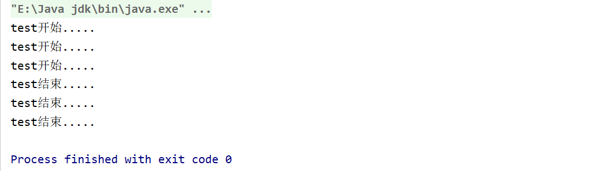


```java
//修改Sync类，在方法内部加上 Synchorized进行修饰
class Sync{
    public void test(){
        synchronized (this){
            System.out.println("test开始.....");
            try {
                Thread.sleep(1000);
            } catch (InterruptedException e) {
                e.printStackTrace();
            }
            System.out.println("test结束.....");
        }
    }
}
```

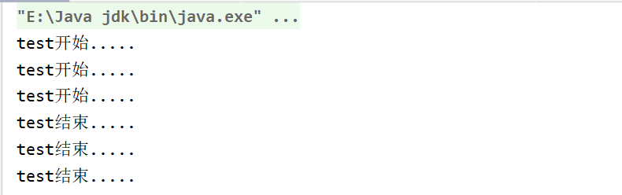

**分析：**为什么改成了内部 Synchorized之后依然不起作用呢？

**关键：Synchorized锁住的是括号中的对象，而不是代码。对于非 static的 Synchorized方法，锁住的就是对象本身也就是 this**

代码中每个线程中都new了一个Sync类的对象，也就是产生了三个Sync对象，由于不是同一个对象，所以可以多线程同时运行synchronized方法或代码段。

**优化：**我们在用synchronized关键字的时候，能缩小代码段的范围就尽量缩小，能在代码段上加同步就不要再整个方法上加同步。这叫减小锁的粒度，使代码更大程度的并发。


```java
//修改 synchorized(xxx) ，改为锁住 Sync的class对象
class Sync{
    public void test(){
        synchronized (Sync.class){
            System.out.println("test开始.....");
            try {
                Thread.sleep(1000);
            } catch (InterruptedException e) {
                e.printStackTrace();
            }
            System.out.println("test结束.....");
        }
    }
}
```

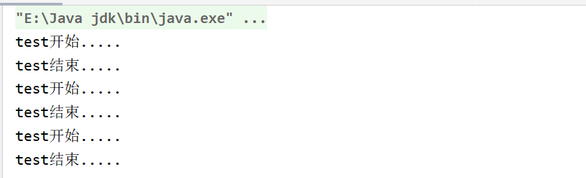

**分析：**java中的同一个类的class对象有几个，取决于加载该class的类装载器，理论上同一个类被不同的类装载器装载所产生class对象不同。但是一般都会采用统一类加载器加载，因此一个工程不会出现同一个类多个 class 对象的情况。那么类的 class对象对于整个类来说就是唯一的，用类的 class 对象作为锁住的对象，相当于全局锁。


```JAVA
//采用 static synchorized修饰
class Sync{
    public static synchronized void test(){
            System.out.println("test开始.....");
            try {
                Thread.sleep(1000);
            } catch (InterruptedException e) {
                e.printStackTrace();
            }
            System.out.println("test结束.....");
    }
}
```


**分析：**同理 static修饰的方法对于一个类来说只有一份，那么加上 synchorized修饰后每次就只能有一个对象能够访问。


```java
//思考对于 title、age、object分别而言，是否锁成功了。
class Sync{
    private String title = "sdfsdf";
    private Integer age = 10;
    private Object object = new Object();

    public String getTitle() {
        return title;
    }

    public  void test(){
        synchronized (object){
            System.out.println("test开始.....");
            try {
                Thread.sleep(2000);
            } catch (InterruptedException e) {
                e.printStackTrace();
            }
            System.out.println("test结束.....");
        }
    }
}
```

**分析：**我们知道，jvm的方法区存放的是被虚拟机加载的类型信息、常量、静态变量、即时编译器编译后的代码缓存等数据。也就是说同一个类它的常量(字符串、数字、字符等等)永远都只有一份并且保存在方法区中，这些常量首先是存储在常量池中，等到类加载后才放入方法区的运行时常量池中。


## 三、Synchorized的实现原理

### 2.1 对象锁(monitor)机制

**同步代码块：**

```java
public class SynchorizedDemo {
    public static void main(String[] args) {
        synchronized (SynchorizedDemo.class){

        }
        method();
    }

    public static void method(){

    }
}
```

假设对于这段代码，代码中有一个全局的同步代码块，然后一个同步静态方法，这两者锁住的都是类的对象。

编译后切换到字节码文件的目录下，执行`javap -v SynchorizedDemo.class`查看字节码文件。


黄色部分就是在添加了 Synchorized关键字后特有的。在线程进入同步代码块去执行时，首先需要执行 `monitorenter`指令来，执行完退出时再执行`monitorexit`指令。

使用 Synchorized 进行同步，关键就在于对监控器 monitor 的获取，当线程获取到对象的 monitor 后才能继续往下执行，否则只有等待。对于 monitor 的获取是互斥的，某个时刻只能有一个线程获取到监控器，其它没有获取到监控器的线程会被阻塞（BLOCKED），然后进入同步队列中等待锁的释放。

上面在 Synchorized代码块中的内容执行完毕后会继续执行 静态方法 method()，但是这个方法的锁对象依旧是这个类对象，所以不需要重复去执行 `monitorenter`指令，这是由于**锁的重入性**，在同一锁程中线程不需要重复获取同一把锁，Synchorized 先天具有重入性。

每个对象有一个计数器，当线程获取到该对象锁后，计数器加一，当释放锁时，计数器减一。


> Synchorized的底层语义就是通过一个 monitor 对象来完成的，其实 wait/notify 方法也是依赖于 monitor对象，这就是为什么只有在同步代码块或者方法中才能调用 wait/notify 方法，否则会抛出异常。


**同步方法：**

```java
public class SynchronizedMethod {
    public synchronized void method() {
        System.out.println("Hello World!");
    }
}
```


同步方法并没有通过指令 monitorenter、monitorexit来完成，不过相对于同步方法，它的常量池中多了 `ACC_SYNCHORIZED `标识符，**JVM就是根据该标识符来实现同步方法的**。

方法调用时会检查是否设置了 ACC_SYNCHORIZED 标识，如果设置了那么必须在获取到对象的 monitor监视器锁后才能执行，方法执行完后再释放 monitor 对象。


**总结：**

​     同步代码块和同步方法的实现本质上没有区别，只是方法的同步是一种隐式的实现，无需通过字节码来实现。两个指令`monitorenter`、`monitorexit`的执行是通过 JVM 调用底层操作系统的 mutex 原语来实现的，被阻塞的线程会被挂起等待重新调度，会导致 “用户态”和“内核态”之间的切换，对性能影响较大。


### 2.2 锁获取和锁释放的内存语义

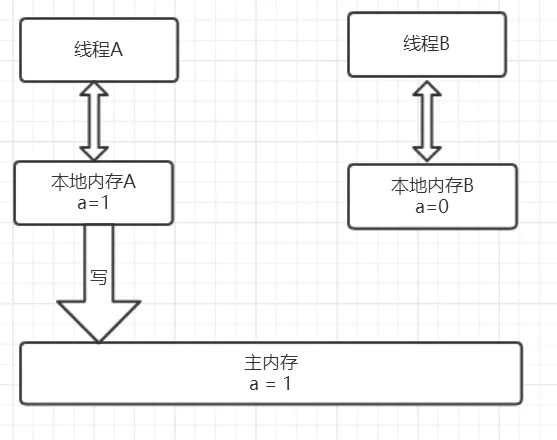

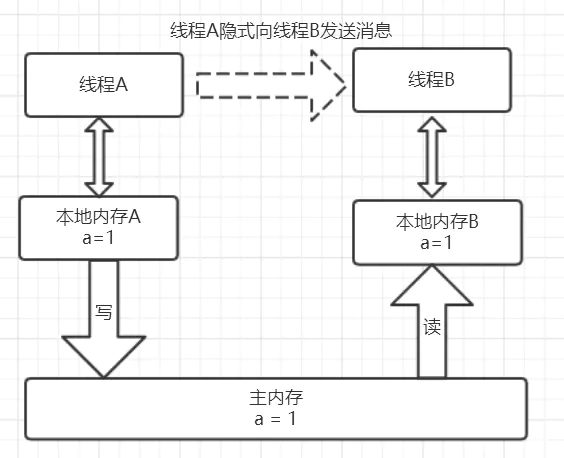

线程A 首先会从主内存中读取出共享变量 a 的值为0，然后拷贝到自己的本地内存中，进行加一操作后再将新值刷新到主内存，整个过程为 A加锁  ---->  执行临界区代码 ----->  A释放锁。

线程B 获取锁的时候会从主内存中读取共享变量 a 的值，更新到自己的内存，然后释放锁的时候同样会刷新主内存的值。


## 四、Synchorized同步概念                                                      

Synchorized 的短板体现在它的**互斥性**，每次只能通过一个线程效率肯定低下。如果这种方式不能改变，那么就必须在其它方面进行优化，比如缩短获取锁的时间。

关键为两个知识点： CAS操作、对象头


### 3.1 CAS操作

#### （1）什么是CAS？

使用锁时，线程是一种**悲观锁**，它会假设每一次执行临界区代码都会产生冲突，因此当前线程获取到锁的时候会阻塞其它线程获取锁资源；而 CAS操作（Compare And Swap）是一种**乐观锁**策略，它假设其它线程访问共享资源时不会出现冲突，就不会阻塞其它线程操作。

但是如果出现了冲突怎么办？此时会使用 CAS操作来比较交换鉴别线程是否出现了冲突，出现冲突就重试当前操作直到没有冲突为止。

#### （2）CAS操作原理

https://blog.csdn.net/qq_43684985/article/details/114625261


### 3.2 Java对象头

#### **对象内存布局：**

JVM中，对象在内存的布局分为三块区域：对象头、实例数据、对齐填充。


1. 实例数据：存放类的属性数据信息，包括父类的属性信息；
2. 对齐填充：由于虚拟机要求对象的起始地址必须是8字节的整数倍。填充数据不是必须存在，只起填充作用。
3. 对象头：Java对象头一般占用2个机器码（32位虚拟机中，1个机器码4个字节；64位虚拟机中，1个机器码8个字节）；但如果是数组类型，会占用3个机器码，因为JVM可以通过Java对象的元数据信息来确定Java对象的大小，但是无法通过元数据来确定数组的大小，所以需要一块来记录数组长度。


#### **对象头：**

> Synchorized锁改变的就是对象头里面的信息。 
>
> Hotspot 虚拟机的对象头主要包括两部分： Mark Word(标记字段)、Class Pointer(类型指针)
>
> Class Pointer就是指向它的类的元数据的指针，JVM通过这个字段来确定一个对象的类型。
>
> Mark Word 用于存储对象自身运行时的数据，它是偏向锁和轻量级锁的实现关键。


#### **Mark Word：**

> Mark Word 存储对象运行时的数据，比如 哈希码(HashCode)、GC分代年龄、锁的状态标志、线程持有的锁、偏向线程ID、偏向时间戳

32位  无锁时 Mark Word的结构：


无锁状态时 `Mark Word`中存储了包含：对象HashCode(25位)、对象分代年龄(4位对应JVM垃圾回收时15次)、锁标志位(2位，总共4种锁状态)、是否是偏向锁(1位)

锁一共是 4种状态，级别从低到高依次是：无状态锁、偏向锁、轻量级锁、重量级锁，这几个状态会随着竞争而逐渐升级，锁可以升级但是不能降级。这种锁升级而不能降级的策略是为了提高获取锁和释放锁的效率。


64位 无锁 Mark Word的结构：


组成：对象HashCode(31位)、对象分代年龄(4位)、锁状态(2位)、是否是偏向锁(1位)、填充字段(26位)


注意 Mark Word的结构不是固定不变的，它会随着程序的运行变化。

 32位虚拟机下Mark Word：

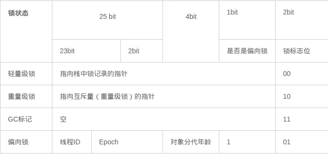

64位虚拟机下 MarkWord：

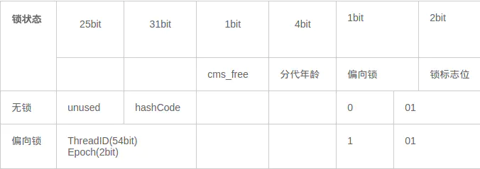

> 对象头的最后两位是锁状态，01 是初始状态表示无锁，它的对象头里面存储的是对象的哈希码；
>
> 随着锁的级别不同，Mark Word 中存储的数据会发生变化。
>
> 如果是偏向锁：存储的就是当前线程的ID；
>
> 如果是轻量级锁：存储的就是指向线程栈中的锁记录的指针；判断一个线程是否拥有锁就是将线程的锁记录地址和对象头中的指针进行比较。


#### **对象头中的 Mark Word 与线程中的 Lock Record：**

在线程进入同步代码块的时候，如果此同步对象没有被锁定，即它的锁标志位是01，则虚拟机首先在当前线程的栈中创建我们称之为“锁记录（Lock Record）”的空间，用于存储锁对象的Mark Word的拷贝**，官方把这个拷贝称为Displaced Mark Word。**整个Mark Word及其拷贝至关重要。

`Monitor`对象存在于每个Java对象的对象头 Mark Word中，存储的是指针的指向。Synchorized 就是通过这种方式获取锁的，也是为什么Java对象中任意对象可以作为锁的原因。

Monitor监视器有两种工作方式：互斥与协作。  互斥体现在多线程环境下为了保证共享变量的数据一致，需要线程互斥访问；协作体现在，一个线程向缓冲区中写数据，另一个线程向缓冲区中读数据，如果发现缓冲区为空就会唤醒线程，这里读和写就是协作关系。


## 五、Synchorized优化----锁优化

> 锁存在的状态包括四种：无锁、偏向锁、轻量级锁、重量级锁
>
> 锁可以从低到高升级，但是不能降级
>
> JDK5中并没有对 Synchorized 关键字做出优化；直到 JDK6 才做了较大的调整，包括使用 JDK5引进的自旋锁，还添加了自适应的CAS操作、锁消除、锁粗化、偏向锁、轻量级锁这些优化策略。
>
> JDK6 中默认是开启偏向锁和轻量级锁的，可以通过 -XX:-UseBiasedLocking 来禁用偏向锁。

### 5.1 自旋锁

线程的阻塞和唤醒需要CPU从用户态切换为内核态，频繁的切换对于CPU来说是一件负担很重的事情，会给系统带来很大的压力。同时如果对象锁只会持续很短的一段时间，那么阻塞和挂起是十分不值得的。

那么不让线程阻塞或挂起，直接让它不断检测锁是否释放不久可以了。因此引入了自旋锁，自旋锁就是当某个线程尝试获取锁时，如果锁已经被其它线程所占用，就一直循环检测锁是否被释放而不是被阻塞或者挂起。

**注意：**自旋锁虽然能够避免操作系统层面的状态转换，但不能替代阻塞，因为自旋也会占用CPU资源。如果持有锁的线程很快就释放了锁，自旋的效果就比较好；反之效果还不如让线程挂起。

​             在JDK6 中，自旋默认次数为10次。


### 5.2 自适应自旋锁

为了解决自旋锁的问题，引入自适应自旋锁，此时自旋的次数不再确定而是可以根据情况转换。策略如下：

* 线程如果自旋成功了，那么下次自旋的次数就更多。因为上次成功了，那么虚拟机就会认为下次还可能成功，就会适当增加一些自旋次数；
* 如果自旋失败了，就减少次数，甚至去除掉自旋的过程。


### 5.3 锁消除

为了保证数据的完整性，在进行操作时需要对这部分进行同步控制。但是有些情况下，JVM检测到可能不存在共享数据的竞争，此时JVM会对锁进行消除。


### 5.4 锁粗化

在使用同步锁的时候，让同步锁的范围尽可能地小是正确的，这样可以保证需要同步的操作数量尽可能地少，如果存在锁竞争，那么等待锁的线程就能够尽快拿到锁。

但是如果频繁的加锁解锁，可能会导致不必要的性能损耗，所以引入锁粗化的概念。锁粗化就是将多个加锁解锁操作融合在一起，扩展成为一个更大的锁，这样避免了性能损耗。


### 5.5 偏向锁

> 大多数情况下，锁不仅不存在多线程竞争，而且总是由同一线程多次获得，为了让线程获得锁的代价更低而引入了偏向锁。（线程交替执行）
>
> **偏向锁是在单线程执行代码块时使用的机制**，如果在多线程并发的环境下线程A尚未执行完代码而线程B请求竞争，则一定会转化为轻量级锁或者重量级锁。

#### （1）引入偏向锁的目的

**为了在没有多线程竞争的情况下减少不必要的轻量级锁执行**。因为轻量级锁的加锁和解锁操作是需要多次依赖于 CAS原子指令的，而偏向锁只有在替换 线程ID 时才会使用一次CAS原子操作。

由于一旦发生竞争偏向锁就必须升级为轻量级锁，所以偏向锁的撤销操作的性能消耗也远小于CAS原子操作的性能消耗。

**轻量级锁是为在线程交替执行同步块时提高性能，而偏向锁是在只有一个线程执行同步块时进一步提高性能。**

#### （2）偏向锁的获取

当一个线程访问同步代码块并获取锁时，会在**对象头**和**栈帧中的锁记录**里存储锁偏向的**线程ID**。以后该线程在进入同步代码块时不需要进行CAS操作，只需要检测是否为偏向锁、锁标识以及线程ID即可。

1. 检测Mark Word 是否为可偏向状态，即是否为偏向锁1，锁标识位为01；
2. 若为可偏向状态，测试线程ID是否为当前线程ID，如果是执行同步代码块；
3. 如果测试线程ID不是当前线程ID，则通过CAS竞争锁，竞争成功，则将Mark Word的线程ID替换为当前线程ID；
4. 竞争失败，证明当前存在多线程竞争的情况，当到达全局安全点，获得偏向锁的线程被挂起，偏向锁升级为轻量级锁，然后被阻塞在安全点的线程继续往下执行同步代码块。


#### （3）偏向锁的释放

偏向锁使用了一种**等到竞争出现才释放锁**的机制。只有其它线程出现竞争锁的情况，持有锁的线程才会释放锁。

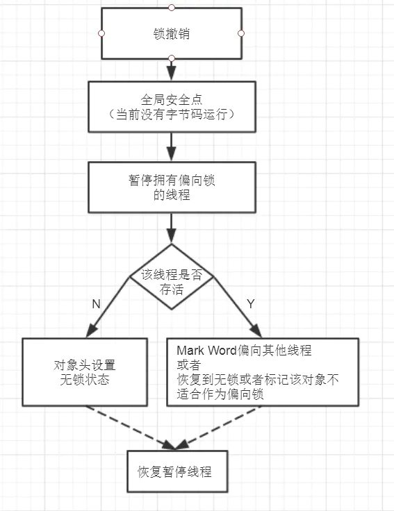

偏向锁的撤销需要等到全局安全点（当前没有字节码运行）。首先会暂停拥有偏向锁的线程，判断该线程是否存活。

如果线程死亡，则将对象头中的锁标识设置为无锁，以允许其余线程竞争；

如果线程存活，则挂起当前线程，并将指向当前线程的锁记录地址的指针放入对象头 Mark Word，升级为轻量级锁(00)，然后恢复持有锁的当前线程，进入轻量级锁的竞争模式。

**注意：**这里只是将当前线程挂起再恢复的过程并没有发生锁的转移，仍然在当前线程手中，只是穿插了“将当前线程ID变更为指向当前线程的锁记录地址的指针”这个事。


#### （3）偏向锁的关闭

默认启用，启动时会有延迟才激活。可以使用 JVM参数进行调整。

`-XX:BiasedLockingStartupDelay=0`：关闭启动延迟

`-XX:UseBiasedLocking=false`：关闭偏向锁，程序默认进入轻量级锁。


### 5.4 轻量级锁

#### （1）引入轻量级锁的目的

引入轻量级锁的目的主要是为了在**减少无实际竞争情况下，使用重量级锁的性能消耗**，减少传统的重量级锁使用操作系统互斥变量产生的性能消耗。 

当释放偏向锁或者多个线程竞争偏向锁时就会升级为轻量级锁。

如果锁的竞争比较激烈，必然会导致锁膨胀升级为重量级锁。

#### （2）轻量级锁的获取

1. 在线程进入同步代码块之前，如果同步对象锁状态为无锁（偏向锁标识为0，锁状态标识为01），那么虚拟机首先会在当前线程的栈帧中建立一个名为**锁记录(Lock Record)的内存空间**，用来存储对象的 Mark Word拷贝。官方称之为 `Displaced Mark Word`。

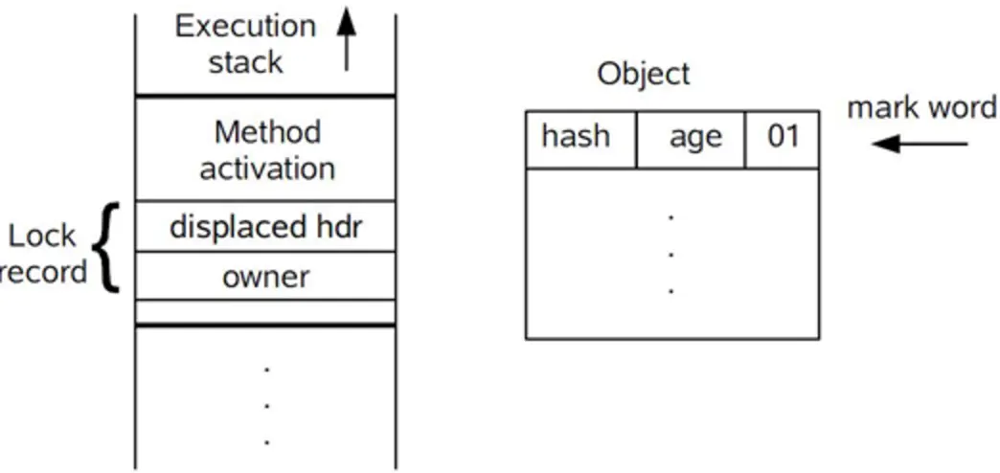

2. 拷贝 Mark Word 到锁记录中；

3. 拷贝成功后，虚拟机将使用CAS操作将 Mark Word字段中的  Lock Word更新为指向当前线程Lock Record(锁记录)的指针；并且将锁记录里面的 owner指针指向对象Mark Word字段。

4. 如果这个更新操作执行成功了，那么当前线程就拥有了对象锁，并将 Mark Word的锁状态字段更新为 "00"表示轻量级锁。

   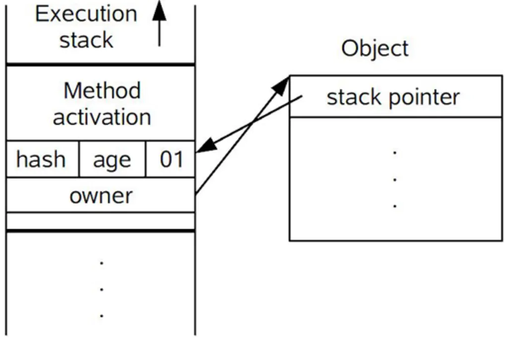

5. 如果这个操作失败了，虚拟机首先会检查对象 Mark Word中的 Lock Word是否指向当前线程的栈。如果是则说明当前线程已经获取了该锁，那就直接进入到同步代码块中去执行；

   如果不是，则说明多个线程竞争锁，**进入自旋操作**防止线程被挂起。若自旋结束时仍然未获得锁，轻量级锁就会膨胀为重量级锁，锁标志的状态直接变为 "10"，Mark Word中存储的就是指向重量级锁（互斥量）的指针，当前线程和后面等待锁的线程进入阻塞状态。

#### （3）轻量级锁的释放

轻量级锁的释放也是通过 CAS 操作来完成的。

1. 通过CAS操作用线程栈帧中锁记录里面的 `Displaced Mark Word`替换对象头中的 `Mark Word`字段；
2. 如果替换成功，整个同步操作完成，恢复到无锁状态；
3. 如果替换失败，说明有其它线程竞争该锁，锁已经升级为重量级锁，那么就要在释放锁的同时唤醒被挂起的线程。

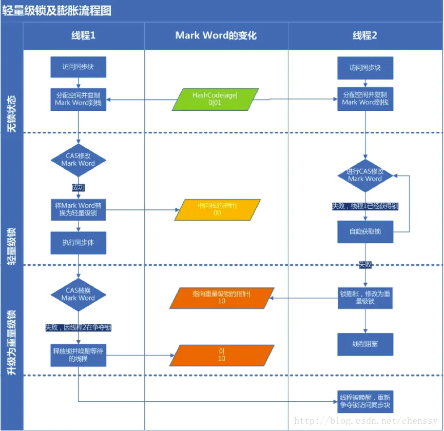


#### （4）为什么在升级为轻量级锁的时候要将对象头Mark Word字段拷贝到线程栈中？

原因一：**线程在申请轻量级锁的时候**需要用这个作为CAS的比较条件，JVM会检查Mark Word中的 Lock Word指针是否指向当前线程锁记录的地址，如果是则说明当前线程已经获取了锁直接进入同步代码块；否则说明存在竞争进入自旋，自旋失败会导致锁膨胀为重量级锁。

原因二：**升级到重量级锁的时候**，通过这个字段比较持有锁的过程中该锁是否被其它线程申请过，如果被申请过，那么释放锁的时候需要唤醒其它线程。


### 5.5 重量级锁

Synchorized 关键字是通过对象内部的监视器monitor 对象来实现上锁和解锁的。但是监视器本身是依赖于底层操作系统的` Mutex Lock `来实现的。操作系统实现线程切换会涉及到用户态与内核态之间的切换，这个成本比较高，这就是为什么  Synchorized 效率低的原因。因此这种依赖于操作系统的 Mutex Lock 所实现的锁称为重量级锁。


### 5.6 偏向锁、轻量级锁、重量级锁之间的转换


### 5.7 锁的优劣

> 各种锁不是相互替代的，锁升级过程包括 无锁 --->  偏向锁 ----> 轻量级锁 ----> 重量级锁；
>
> 锁只能升级不能降级。

1. 如果是单线程使用，偏向锁代价最小。它没有涉及到CAS操作，仅仅比较下对象头就可以了；
2. 如果出现了其他线程竞争，偏向锁升级为轻量级锁；
3. 如果其它线程通过一定次数的CAS操作未成功(自旋失败)，升级为重量级锁。


参考文章：

https://blog.csdn.net/xiao__gui/article/details/8188833

https://juejin.cn/post/6844903600334831629

https://juejin.cn/post/6844903640197513230