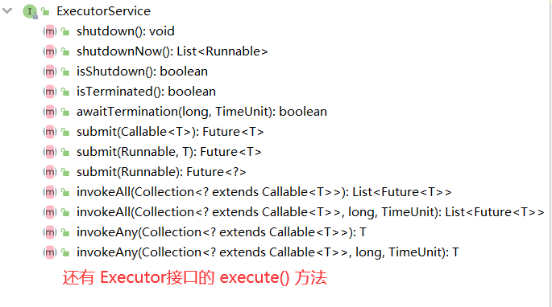
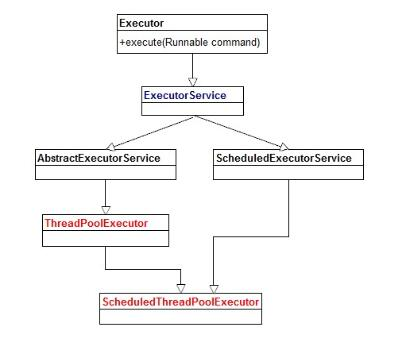
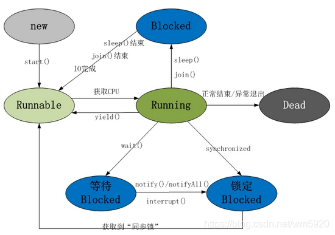
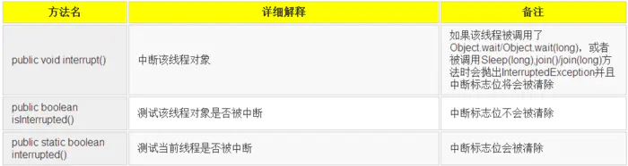

# 线程池


## 一、Java线程池 ExecutorService

### 1. ExecutorService介绍

> ExecutorService 是Java中对线程池定义的一个接口，它存在于 java.util.concurrent 包中，这个接口中定义了后台执行任务相关的方法。





ExecutorService 继承自` Executor` 接口（区分开工厂类 Executors），它有两个实现的子类 `ThreadPoolExecutor`、`ScheduledThreadPoolExecutor`。


### 2. ExecutorService的创建

> Java 提供了一个工厂类 Executors 来创建各种类型的 ExecutorService 线程池，总共可以创建以下四种线程池。

* `newCachedThreadPool`：创建一个可缓存的线程池，如果线程池长度超过需要可以灵活地回收空闲线程；如果没有可以回收的，则创建新线程。

* `newFixedThreadPool`：创建一个固定大小的线程池，可以控制最大的线程并发数，超出的线程必须在队列中等待。

* `newScheduledThreadPool`：创建一个定长的线程池，支持周期性的执行任务；

* `newSingleThreadExecutor`：创建一个单线程化的线程池，它只会用唯一的工作线程来执行任务，保证所有任务按照指定顺序（FIFO、LIFO）执行。

  `Executors`只是一个工厂类，它所有方法返回的都是 ThreadPoolExecutor、ScheduledThreadPoolExecutor两个类的实例。


### 3. ExecutorService的使用

```java
ExecutorService executorService = Executors.newFixedThreadPool(10);
executorService.execute(new Runnable() {
    @Override
    public void run() {
      System.out.println("Asynchoronus task");
    }
});
executorService.shutdown();
```


### 4. ExecutorService的执行

#### 4.1 execute(Runnable xxx)

```java
ExecutorService executorService = Executors.newSingleThreadExecutor();
  executorService.execute(new Runnable() {
    @Override
    public void run() {
      System.out.println("Runnable task");
    }
});
```

`execute(Runnable xxx)`方法接收一个 Runnable 的实例，并且异步执行。

这个方法的缺点就是无法获取任务的执行结果，我们如果想要获取任务的执行结果就需要传入一个 Callable的实例。

#### 4.2 submit(Runnable xxx)

```java
Future future = executorService.submit(new Runnable() {
    @Override
    public void run() {
      System.out.println("submit Runnable task");
    }
});
System.out.println(future.get());
```

`execute()`和`submit()`方法的区别是后一个方法可以返回一个`Future`对象，通过返回的 `Future`对象我们可以检查提交的任务是否执行完毕。

如果执行完毕，那么`future.get()`方法会返回一个null。注意 `future.get()`方法会产生阻塞。

#### 4.3 submit(Callable xxx)

```java
Future future1 = executorService.submit(new Callable() {
    @Override
    public Object call() throws Exception {
      return "callable submit";
    }
});
System.out.println(future1.get());
```

`submit(Callable xxx)`和`submit(Runnable xxx)`方法类似，都能够返回一个 Future对象但是，submit(Callable)接收的是一个Callable的实现，Callable接口中的`call()`方法有一个返回值，可以返回任务的执行结果，而Runnable接口中的`run()`方法是`void`的，没有返回值。

#### 4.4 invokeAny(Callable集合)

```java
ExecutorService executorService = Executors.newSingleThreadExecutor();

Set<Callable<String>> callables = new HashSet<Callable<String>>();

callables.add(new Callable<String>() {
public String call() throws Exception {
    return "Task 1";
}
});
callables.add(new Callable<String>() {
public String call() throws Exception {
    return "Task 2";
}
});
callables.add(new Callable<String>() {
    public String call() throws Exception {
    return "Task 3";
}
});

String result = executorService.invokeAny(callables);
System.out.println("result = " + result);
executorService.shutdown();
```

该方法接收一个Callable的集合，执行这个方法不会返回 Future，但是会返回所有 Callable()任务中一个任务的执行结果，这个方法也无法保证返回的是哪个任务的结果。

#### 4.5 invokeAll(Callable集合)

```java
ExecutorService executorService = Executors.newSingleThreadExecutor();

Set<Callable<String>> callables = new HashSet<Callable<String>>();

callables.add(new Callable<String>() {
public String call() throws Exception {
    return "Task 1";
}
});
callables.add(new Callable<String>() {
    public String call() throws Exception {
    return "Task 2";
}
});
callables.add(new Callable<String>() {
public String call() throws Exception {
    return "Task 3";
}
});

List<Future<String>> futures = executorService.invokeAll(callables);

for(Future<String> future : futures){
System.out.println("future.get = " + future.get());
}

executorService.shutdown();
```

该方法与 `invokeAny(xxx)`类似，不过返回的是所有任务执行后的 Future集合。


### 5. ExecutorService关闭

当我们使用完成ExecutorService之后应该关闭它，否则它里面的线程会一直处于运行状态。

举个例子，如果的应用程序是通过main()方法启动的，在这个main()退出之后，如果应用程序中的ExecutorService没有关闭，这个应用将一直运行。之所以会出现这种情况，是因为ExecutorService中运行的线程会阻止JVM关闭。

如果要关闭ExecutorService中执行的线程，我们可以调用ExecutorService.shutdown()方法。在调用shutdown()方法之后，ExecutorService不会立即关闭，但是它不再接收新的任务，直到当前所有线程执行完成才会关闭，所有在shutdown()执行之前提交的任务都会被执行。

如果我们想立即关闭ExecutorService，我们可以调用ExecutorService.shutdownNow()方法。这个动作将跳过所有正在执行的任务和被提交还没有执行的任务。但是它并不对正在执行的任务做任何保证，有可能它们都会停止，也有可能执行完成。


## 二、线程的生命周期及五种状态(操作系统版本)



* **新建状态（New）**：当线程对象对创建后，即进入了新建状态，如：Thread t = new MyThread();

* **就绪状态（Runnable）**：当调用线程对象的start()方法（t.start();），线程即进入就绪状态。处于就绪状态的线程，只是说明此线程已经做好了准备，随时等待CPU调度执行，并不是说执行了t.start()此线程立即就会执行；
* **运行状态（Running）**：当CPU开始调度处于就绪状态的线程时，此时线程才得以真正执行，即进入到运行状态。注：就 绪状态是进入到运行状态的唯一入口，也就是说，线程要想进入运行状态执行，首先必须处于就绪状态中；
* **阻塞状态（Blocked）**：处于运行状态中的线程由于某种原因，暂时放弃对CPU的使用权，停止执行，此时进入阻塞状态，直到其进入到就绪状态，才 有机会再次被CPU调用以进入到运行状态。根据阻塞产生的原因不同，阻塞状态又可以分为三种：

​           1.  等待阻塞：运行状态中的线程执行wait()方法，使本线程进入到等待阻塞状态；

​           2.  同步阻塞 – 线程在获取synchronized同步锁失败(因为锁被其它线程所占用)，它会进入同步阻塞状态；

​           3.  其他阻塞 – 通过调用线程的sleep()或join()或发出了I/O请求时，线程会进入到阻塞状态。当sleep()状态超时、join()等待线程终止或者超时、或者I/O处理完毕时，线程重新转入**就绪状态**。

* **死亡状态（Dead）**：线程执行完了或者因异常退出了run()方法，该线程结束生命周期。


 线程资源包括两部分：锁资源、CPU资源；

`sleep(long mills)`：让出CPU资源，但是不会释放锁资源；

`wait()`：让出CPU资源，同时释放锁资源；

锁是用来线程同步的，sleep(long mills)虽然让出了CPU，但是不会让出锁，其他线程可以利用CPU时间片了，但如果其他线程要获取sleep(long mills)拥有的锁才能执行，则会因为无法获取锁而不能执行，继续等待。
但是那些没有和sleep(long mills)竞争锁的线程，一旦得到CPU时间片即可运行了。


## 三、线程的生命周期和六种状态(Java版本)

* **初始(New)：**新建了一个线程对象，但是还没有调用start()方法；

* **运行(Runnable)：**Java中将就绪（Ready）和运行中（Running）统称为运行；

  线程对象创建后，当其它线程调用了 start()方法后线程进入 Ready，线程进入线程池等待被调度选用；当获得CPU时间片后变为运行状态 Running；

* **阻塞(Blocked)：**表示线程阻塞于锁；

* **等待(Waiting)：**进入该状态的线程需要等待其它线程做出一些特定的操作；

* **超时等待(TIMED_Waiting)：**该状态不同于Waiting，它可以在指定的时间后自行返回；

* **终止(TERMINATED)：**表示线程已经执行完毕。


### 3.1 线程状态图


线程创建之后会调用 start() 方法开始执行，此时线程进入 Runnable(运行状态)；

当调用 wait()、join()、LockSupport.lock()方法时，会进入到 Waiting 状态；

当调用 wait()、join()、sleep()、LockSupport.parkNanos()、LockSupport.parkUntil()方法时会进入超时等待状态，当超时等待结束后线程会切换到Runnable 状态；

另外处于 Waiting、TIMED_Waiting 两个状态时可以通过 Object.notify()、Object.notifyAll() 、LockSupport.unpark()方法切换到 Runnable状态。

当线程出现竞争锁资源的时候，即等待获取锁的时候会进入 BLOCKED阻塞状态。当线程获取到锁资源时进入Runnable状态。

线程运行结束后，线程进入到TERMINATED状态。

> 当线程进入到synchronized方法或者synchronized代码块时，线程切换到的是BLOCKED状态；而使用java.util.concurrent.locks下lock进行加锁的时候线程切换的是WAITING或者TIMED_WAITING状态，因为lock会调用LockSupport的方法。
>
> ReentrantLock 底层加锁的原理就是调用了 LockSupport.park()方法，相比对Synchorized 它所占用的资源更少，在JDK层面就解决了问题，不必等到os 层面去解决。


## 四、线程状态的基本操作

### 4.1 interrupt

中断可以理解为线程的一个标志位，它表示一个运行中的线程是否被其它线程进行了中断操作。

其它线程可以调用该线程的 interrupt() 方法对其进行中断操作，同时该线程可以调用 isInterrupt() 方法来感知其它线程对自身的中断操作，从而做出响应；同时可以调用 Thread的静态方法 interrupt() 对当前线程进行中断操作，该方法会清除标志位。**需要注意的是，当抛出 InterruptedException时候，会清除中断标志位，也就是在调用 isInterrupted 方法时会返回 false**



```java
public class InterruptDemo {
    public static void main(String[] args) throws InterruptedException {
        //sleepThread睡眠1000ms
        final Thread sleepThread = new Thread() {
            @Override
            public void run() {
                try {
                    Thread.sleep(1000);
                } catch (InterruptedException e) {
                    e.printStackTrace();
                }
                super.run();
            }
        };
        //busyThread一直执行死循环
        Thread busyThread = new Thread() {
            @Override
            public void run() {
                while (true) ;
            }
        };
        sleepThread.start();
        busyThread.start();
        sleepThread.interrupt();
        busyThread.interrupt();
        while (sleepThread.isInterrupted()) ;
        System.out.println("sleepThread isInterrupted: " + sleepThread.isInterrupted());
        System.out.println("busyThread isInterrupted: " + busyThread.isInterrupted());
    }
}
```


开启了两个线程分别为sleepThread和BusyThread, sleepThread睡眠1s，BusyThread执行死循环。然后分别对着两个线程进行中断操作，可以看出sleepThread抛出InterruptedException后清除标志位，而busyThread就不会清除标志位。

另外，同样可以通过中断的方式实现线程间的简单交互， while (sleepThread.isInterrupted()) 表示在Main中会持续监测sleepThread，一旦sleepThread的中断标志位清零，即sleepThread.isInterrupted()返回为false时才会继续Main线程才会继续往下执行。因此，中断操作可以看做线程间一种简便的交互方式。一般在**结束线程时通过中断标志位或者标志位的方式可以有机会去清理资源，相对于武断而直接的结束线程，这种方式要优雅和安全。**


### 4.2 join

> join方法可以看做是线程间协作的一种方式，很多时候，一个线程的输入可能非常依赖于另一个线程的输出。如果一个线程实例A执行了threadB.join(),其含义是：当前线程A会等待threadB线程终止后threadA才会继续执行。

```java
public class TestJoin {
    public static void main(String[] args) {
        Thread previousThread = Thread.currentThread();
        for(int i=0;i<10;i++){
            Thread current = new JoinThread(previousThread);
            current.start();
            previousThread = current;
        }
    }

    static class JoinThread extends Thread{
        private Thread thread;

        public JoinThread(Thread thread){
            this.thread = thread;
        }

        @Override
        public void run() {
            try {
                thread.join();
                System.out.println(thread.getName()+"terminated.");
            } catch (InterruptedException e) {
                e.printStackTrace();
            }
        }
    }
}
```

创建了10个线程，每次后一个线程都必须等待前一个线程操作完毕后才能继续执行。


### 4.3 sleep

`public static native void sleep(long millis) throws InterruptedException;`

sleep 方法是 Thread的静态方法，它是让当前线程按照指定的时间休眠。注意的是 sleep方法并不会释放锁，而只是释放掉 cpu 资源，sleep经常与 wait 方法拿来做比较。

#### sleep VS  wait

两者的主要区别：

* sleep 是Thread的静态方法；而 wait 是Object类的方法；
* wait() 必须在同步方法或同步代码块中使用，也就是必须获取到对象锁[类似的还有 notify()方法]。而 sleep方法没有限制，可以在任何地方使用。
* wait() 会释放掉cpu资源和对象锁，使得该线程进入等待池中(Waiting状态)；而 sleep 只会释放掉cpu资源不会释放锁，该线程进入超时等待状态(TIMED_Waiting状态)。
* sleep() 在进过超时时间后会自动转换为 Runnable状态等待cpu的再次调度；而 wait() 方法必须等待 Object.notify()/Object.notifyAll() 通知后，才能进行 Runnable状态。


#### 4.4 yield

`public static native void yield();`

yield 是一个静态方法，一旦执行它会使当前线程让出 CPU ，但是这并不意味着当前线程不能再执行。如果在下一次竞争中当前线程又获得了CPU时间片，那么依旧会继续执行。

yield让出的时间片只会分配给**同优先级**的线程去使用；而sleep 方法让出的时间片可供**所有线程**去竞争。


> 关于线程优先级：

现代操作系统基本采用时分的形式调度运行的线程，操作系统会分出一个个时间片，线程会分配到若干时间片，当前时间片用完后就会发生线程调度，并等待这下次分配。线程分配到的时间多少也就决定了线程使用处理器资源的多少，而线程优先级就是决定线程需要或多或少分配一些处理器资源的线程属性。

线程优先级可以通过 `xxx.setPriority(int)`来设置优先级，优先级范围为1~10，默认为5，优先级高的线程相较于低的线程优先获取处理器的时间片。


#### 4.5 守护线程 Daemon

> 守护线程是一种特殊的线程，比如 垃圾回收线程、JIT线程都可以理解为守护线程。
>
> 与之对应的是用户线程，用户线程可以理解为工作线程，它会完成整个系统的业务操作。用户线程结束后就意味着整个业务工作结束了，守护线程会退出。

```java
public class TestDaemon {
    public static void main(String[] args) {
        Thread daemonThread = new Thread(){
            @Override
            public void run() {
                while(true){
                    System.out.println("守护中....");
                    try {
                        Thread.sleep(500);
                    } catch (InterruptedException e) {
                        e.printStackTrace();
                    } finally {
                        System.out.println("finally block");
                    }
                }
            }
        };
        daemonThread.setDaemon(true);
        daemonThread.start();

        try {
            Thread.sleep(800);
        } catch (InterruptedException e) {
            e.printStackTrace();
        }
    }
}
```


参考文章：

​        https://blog.csdn.net/suifeng3051/article/details/49443835

​        https://blog.csdn.net/suifeng3051/article/details/49444177

​        https://blog.csdn.net/pange1991/article/details/53860651?utm_medium=distribute.pc_relevant.none-task-blog-2%7Edefault%7EBlogCommendFromBaidu%7Edefault-5.control&dist_request_id=&depth_1-utm_source=distribute.pc_relevant.none-task-blog-2%7Edefault%7EBlogCommendFromBaidu%7Edefault-5.control